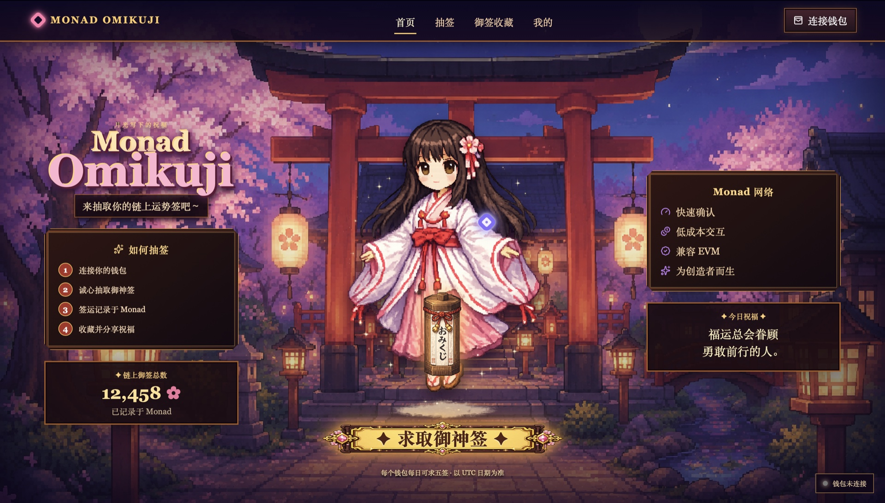

# Monad Omikuji

**English** | [中文](./README.zh-CN.md)

[](https://react.dev/)
[](https://www.typescriptlang.org/)
[](https://soliditylang.org/)
[](https://docs.monad.xyz/)
[](https://supabase.com/)
[](https://vercel.com/)

Monad Omikuji is an animated pixel-art Web3 fortune ritual for Monad Testnet. Visitors enter a moonlit shrine, draw one of seven weighted omikuji outcomes, record the result on-chain, and keep claimed fortunes in a personal collection.

## Preview

[](https://monad-omikuji.vercel.app/)

**[Enter the live shrine →](https://monad-omikuji.vercel.app/)**

## Product Experience

- Responsive desktop and mobile shrine scenes.
- Animated shrine maiden, falling sakura, glowing particles and lantern ambience.
- Ritual state machine: prayer, box shake, fortune stick, wallet confirmation, chain confirmation and paper reveal.
- Seven outcomes: 大吉, 中吉, 小吉, 吉, 末吉, 凶 and 大凶.
- SSR / SR / R presentation with career, love and wealth ratings.
- RPG-style collection, profile and wallet-claim experience.
- Up to five draws per wallet per UTC day.

## Important Demo Notice

This repository is prepared for Monad Testnet and educational demonstration. No real assets or paid fortune service are involved.

When the contract or Supabase configuration is incomplete, the interface enters a clearly labeled isolated Demo Mode. A failed live transaction never silently becomes a simulated success.

## Architecture

```text
src/                    React + TypeScript DApp
app/globals.css         Pixel-art responsive design system
public/assets/          Shrine, maiden and UI artwork
contracts/              Solidity fortune contract
ignition/               Hardhat deployment module
supabase/migrations/    Profiles, wallets, fortunes, nonces and RLS
supabase/functions/     Wallet signature and transaction verification
tests/                  Fortune mapping and Demo Mode tests
```

## Local Development

Requirements: Node.js 22.13 or newer.

```bash
npm install
cp .env.example .env.local
npm run dev
```

Open the Vite URL printed in the terminal. An empty cloud configuration automatically activates Demo Mode.

```bash
npm run typecheck
npm test
npm run build
npm run contract:check
```

## Environment Variables

Frontend-safe values belong in `.env.local` and in Vercel:

```env
VITE_SUPABASE_URL=
VITE_SUPABASE_ANON_KEY=
VITE_CONTRACT_ADDRESS=
VITE_MONAD_RPC_URL=https://testnet-rpc.monad.xyz
VITE_MONAD_EXPLORER_URL=https://testnet.monadexplorer.com
VITE_WALLETCONNECT_PROJECT_ID=
VITE_ENABLE_GOOGLE_AUTH=false
VITE_DEMO_MODE=false
```

Never place a private key or a Supabase `service_role` key in a `VITE_` variable.

## Smart Contract

`FortuneContract` exposes `drawFortune`, `canDraw`, `getLatestFortune` and record-reading functions. It emits `FortuneDrawn` and enforces five draws per wallet per UTC day.

Current Monad Testnet deployment:

```text
Contract: 0x3b31775c81d0da5ca59574d29c1bf86a6fda4993
Transaction: 0x5912c2797e7e504c22338ce2c67acc10bc6adc3438a50979c43b8ea9895d8610
Block: 45675840
```

[View the deployed contract on Monad Explorer](https://testnet.monadexplorer.com/address/0x3b31775c81d0da5ca59574d29c1bf86a6fda4993)

Create a local `.env` that is never committed:

```env
MONAD_RPC_URL=https://testnet-rpc.monad.xyz
MONAD_PRIVATE_KEY=0x_your_testnet_deployer_private_key
```

Then run:

```bash
npm run contract:compile
npm run test:contract
npm run contract:deploy
```

After deployment, copy the contract address to `VITE_CONTRACT_ADDRESS` and the Supabase Edge Function `CONTRACT_ADDRESS` secret.

The included randomness combines `block.prevrandao`, timestamp, caller and draw count. This is suitable only for a non-monetary demonstration. A production game with economic value should use verifiable randomness.

## Supabase Setup

1. Create a Supabase project.
2. Run `supabase/migrations/202607170001_monad_omikuji.sql`.
3. Enable Email Magic Link authentication.
4. Optionally configure Google OAuth and set `VITE_ENABLE_GOOGLE_AUTH=true`.
5. Deploy `supabase/functions/wallet-claim`.
6. Add `SUPABASE_URL`, `SUPABASE_SERVICE_ROLE_KEY`, `MONAD_RPC_URL` and `CONTRACT_ADDRESS` as Edge Function secrets.

The verification function checks the authenticated user, one-time nonce, recovered signer, contract address, successful transaction receipt and emitted `FortuneDrawn` event before claiming a fortune.

## Vercel Deployment

```text
Framework Preset: Vite
Root Directory: ./
Build Command: npm run build
Output Directory: dist
Install Command: npm install
```

Add the frontend environment variables for Preview and Production, then add the Vercel domain to Supabase Auth redirect URLs.

## Security Notes

- Wallet signatures prove address ownership only and never request token spending permission.
- Nonces expire after ten minutes and can be used once.
- Row Level Security isolates each user's profile, wallets and fortunes.
- Wallet binding and fortune insertion are performed only by the verifying Edge Function.
- Transaction hashes are read again from Monad; client-supplied fortune values are ignored.

## Verification

The current implementation passes TypeScript checking, four unit tests, a Vite production build and direct Solidity bytecode compilation.
